# Problem 4 - Multi-Identity Banking

## Explicación de la solución

En el diseño original la mayoría de las reglas estaban dentro de `BankingService`, usando muchos `if` y `switch`. Esto hacía que cada vez que se agregaba una nueva identidad, operación o procesador hubiera que modificar varias partes de la clase.

La solución utiliza herencia y polimorfismo para distribuir las responsabilidades entre las clases correspondientes.

Las identidades se separan en diferentes clases que heredan de `Identity`. Cada identidad maneja sus propias operaciones permitidas, límite diario y reglas adicionales.

Las operaciones también se separan en clases específicas. De esta forma, cada operación solamente tiene los atributos que necesita. Por ejemplo, `InternationalTransfer` tiene un BIC, mientras que `Deposit` no lo necesita.

Los procesadores externos no se pueden modificar porque representan APIs de entidades bancarias diferentes. Para solucionar esto se utilizan adapters. Cada adapter envuelve un procesador y convierte su API al método común `process()`.

`BankingService` solamente coordina las clases y ya no necesita conocer los detalles de cada identidad, operación o procesador.

## Uso del polimorfismo

El polimorfismo se utiliza cuando `BankingService` trabaja con referencias de las clases generales y Java ejecuta el método correspondiente a la clase real.

```java
Identity identity = user.findIdentity();
identity.isOperationAllowed(operation);
identity.validateRules(operation, today);
BankOperation operation = ...;
operation.getTotalAmount();
Processor processor = ...;
processor.process(identity, operation);
```

Por ejemplo, si `identity` contiene un `BusinessIdentity`, se ejecutan los métodos de `BusinessIdentity`. Si contiene un `MinorIdentity`, se ejecutan los métodos de `MinorIdentity`.

Lo mismo ocurre con las operaciones. `operation` puede ser un `Deposit`, `Withdrawal`, `DomesticTransfer`, `InternationalTransfer` o `Payroll`.

También se aplica en los procesadores. `BankingService` trabaja con `Processor`, pero el método `process()` es ejecutado por el adapter correspondiente.

## Wrapping de los procesadores

Los procesadores originales tienen métodos diferentes y no se pueden modificar.

```text
NationalBankProcessor
postTransaction(...)

PacificBankProcessor
submit(...)
submitPayroll(...)

SwiftGatewayProcessor
sendWire(...)
```

Por eso cada uno se envuelve con un adapter:

```text
NationalBankAdapter -> NationalBankProcessor
PacificBankAdapter -> PacificBankProcessor
SwiftGatewayAdapter -> SwiftGatewayProcessor
```

Todos los adapters implementan el mismo método:

```java
process(Identity identity, BankOperation operation)
```

Por ejemplo, internamente cada adapter puede hacer la conversión necesaria:

```java
// NationalBankAdapter
return nationalBank.postTransaction(
    identity.getAccountNumber(),
    operation.getClass().getSimpleName(),
    operation.getTotalAmount(),
    destination
);

// PacificBankAdapter
return pacificBank.submit(
    identity.getAccountNumber(),
    "TRF",
    Math.round(operation.getTotalAmount() * 100),
    destination
);

// SwiftGatewayAdapter
return swiftGateway.sendWire(
    identity.getAccountNumber(),
    destination,
    bic,
    operation.getTotalAmount(),
    operation.getCurrency()
);
```

De esta forma, `BankingService` solamente necesita:

```java
processor.process(identity, operation);
```

Los detalles de cada API quedan dentro de su propio adapter.

## Regla de acceso a procesadores

La regla de que los menores solamente pueden utilizar `National Bank` se coloca en `ProcessorPolicy`.

Esta regla relaciona una identidad con un procesador, por lo que no pertenece completamente a `Identity` ni a `Processor`.

Así se pueden agregar nuevas reglas entre identidades y procesadores sin modificar las clases de identidad ni los adapters.

## Clases principales

### Identity

Clase abstracta.

**Atributos:**

- `documentNumber : String`
- `accountNumber : String`

**Métodos:**

- `isOperationAllowed(operation : BankOperation) : boolean`
- `dailyLimit() : double`
- `validateRules(operation : BankOperation, today : LocalDate) : String`

### PersonalIdentity

Hereda de `Identity`.

**Métodos:**

- `isOperationAllowed(operation : BankOperation) : boolean`
- `dailyLimit() : double`
- `validateRules(operation : BankOperation, today : LocalDate) : String`

### BusinessIdentity

Hereda de `Identity`.

**Atributos:**

- `companyName : String`

**Métodos:**

- `isOperationAllowed(operation : BankOperation) : boolean`
- `dailyLimit() : double`
- `validateRules(operation : BankOperation, today : LocalDate) : String`

### MinorIdentity

Hereda de `Identity`.

**Atributos:**

- `guardianUserId : String`

**Métodos:**

- `isOperationAllowed(operation : BankOperation) : boolean`
- `dailyLimit() : double`
- `validateRules(operation : BankOperation, today : LocalDate) : String`

### ForeignResidentIdentity

Hereda de `Identity`.

**Atributos:**

- `countryCode : String`
- `residencyExpiresOn : LocalDate`

**Métodos:**

- `isOperationAllowed(operation : BankOperation) : boolean`
- `dailyLimit() : double`
- `validateRules(operation : BankOperation, today : LocalDate) : String`

### BankOperation

Clase abstracta.

**Atributos:**

- `amount : double`
- `currency : String`

**Métodos:**

- `getAmount() : double`
- `getCurrency() : String`
- `getTotalAmount() : double`

### Deposit

Hereda de `BankOperation`.

**Métodos:**

- `getTotalAmount() : double`

### Withdrawal

Hereda de `BankOperation`.

**Métodos:**

- `getTotalAmount() : double`

### DomesticTransfer

Hereda de `BankOperation`.

**Atributos:**

- `destinationAccount : String`

**Métodos:**

- `getDestinationAccount() : String`
- `getTotalAmount() : double`

### InternationalTransfer

Hereda de `BankOperation`.

**Atributos:**

- `destinationAccount : String`
- `destinationBic : String`

**Métodos:**

- `getDestinationAccount() : String`
- `getDestinationBic() : String`
- `getTotalAmount() : double`

### Payroll

Hereda de `BankOperation`.

**Atributos:**

- `payrollAccounts : List`
- `approvalCode : String`

**Métodos:**

- `getPayrollAccounts() : List`
- `getApprovalCode() : String`
- `getTotalAmount() : double`

### Processor

Interfaz.

**Métodos:**

- `process(identity : Identity, operation : BankOperation) : ProcessorResult`
- `supports(operation : BankOperation) : boolean`
- `getName() : String`

### NationalBankAdapter

Implementa `Processor`.

**Atributos:**

- `nationalBank : NationalBankProcessor`

**Métodos:**

- `process(identity : Identity, operation : BankOperation) : ProcessorResult`
- `supports(operation : BankOperation) : boolean`
- `getName() : String`

### PacificBankAdapter

Implementa `Processor`.

**Atributos:**

- `pacificBank : PacificBankProcessor`

**Métodos:**

- `process(identity : Identity, operation : BankOperation) : ProcessorResult`
- `supports(operation : BankOperation) : boolean`
- `getName() : String`

### SwiftGatewayAdapter

Implementa `Processor`.

**Atributos:**

- `swiftGateway : SwiftGatewayProcessor`

**Métodos:**

- `process(identity : Identity, operation : BankOperation) : ProcessorResult`
- `supports(operation : BankOperation) : boolean`
- `getName() : String`

### NationalBankProcessor

Procesador externo que no se modifica.

**Métodos:**

- `postTransaction(...) : String`

### PacificBankProcessor

Procesador externo que no se modifica.

**Métodos:**

- `submit(...) : String`
- `submitPayroll(...) : String`

### SwiftGatewayProcessor

Procesador externo que no se modifica.

**Métodos:**

- `sendWire(...) : String`

### ProcessorResult

**Atributos:**

- `success : boolean`
- `reference : String`
- `fee : double`
- `message : String`

### ProcessorPolicy

**Métodos:**

- `isAllowed(identity : Identity, processor : Processor) : boolean`

### User

**Atributos:**

- `id : String`
- `fullName : String`
- `identities : List`

**Métodos:**

- `addIdentity(identity : Identity) : void`
- `findIdentity() : Identity`

### DailyUsageTracker

**Métodos:**

- `usedOn(identity : Identity, day : LocalDate) : double`
- `record(identity : Identity, day : LocalDate, amount : double) : void`

### AuditLog

**Métodos:**

- `record(entry : String) : void`
- `getEntries() : List`

### BankingService

**Atributos:**

- `processors : List`
- `usageTracker : DailyUsageTracker`
- `auditLog : AuditLog`
- `processorPolicy : ProcessorPolicy`

**Métodos:**

- `execute(user, identity, operation, processor, today) : ProcessorResult`

## Agregar nuevos tipos

Si se necesita agregar una nueva identidad, por ejemplo `SeniorIdentity`, se crea una nueva clase que herede de `Identity`.

En este caso solamente se agrega la nueva clase con su límite de `3000` y sus reglas correspondientes. `BankingService` no necesita modificarse.

Si se necesita agregar un nuevo procesador, por ejemplo `CryptoProcessor`, se crea su adapter implementando `Processor`.

El nuevo adapter se encarga de adaptar los métodos del procesador externo al método común `process()`.

Esto evita tener que agregar nuevos `if` o `switch` dentro de `BankingService`.

## Diagrama Mermaid

```mermaid
classDiagram

class Identity {
    <<abstract>>
    -documentNumber : String
    -accountNumber : String
    +isOperationAllowed(operation : BankOperation) boolean
    +dailyLimit() double
    +validateRules(operation : BankOperation, today : LocalDate) String
}

class PersonalIdentity {
    +isOperationAllowed(operation : BankOperation) boolean
    +dailyLimit() double
    +validateRules(operation : BankOperation, today : LocalDate) String
}

class BusinessIdentity {
    -companyName : String
    +isOperationAllowed(operation : BankOperation) boolean
    +dailyLimit() double
    +validateRules(operation : BankOperation, today : LocalDate) String
}

class MinorIdentity {
    -guardianUserId : String
    +isOperationAllowed(operation : BankOperation) boolean
    +dailyLimit() double
    +validateRules(operation : BankOperation, today : LocalDate) String
}

class ForeignResidentIdentity {
    -countryCode : String
    -residencyExpiresOn : LocalDate
    +isOperationAllowed(operation : BankOperation) boolean
    +dailyLimit() double
    +validateRules(operation : BankOperation, today : LocalDate) String
}

Identity <|-- PersonalIdentity
Identity <|-- BusinessIdentity
Identity <|-- MinorIdentity
Identity <|-- ForeignResidentIdentity


class BankOperation {
    <<abstract>>
    -amount : double
    -currency : String
    +getAmount() double
    +getCurrency() String
    +getTotalAmount() double
}

class Deposit {
    +getTotalAmount() double
}

class Withdrawal {
    +getTotalAmount() double
}

class DomesticTransfer {
    -destinationAccount : String
    +getDestinationAccount() String
    +getTotalAmount() double
}

class InternationalTransfer {
    -destinationAccount : String
    -destinationBic : String
    +getDestinationAccount() String
    +getDestinationBic() String
    +getTotalAmount() double
}

class Payroll {
    -payrollAccounts : List
    -approvalCode : String
    +getPayrollAccounts() List
    +getApprovalCode() String
    +getTotalAmount() double
}

BankOperation <|-- Deposit
BankOperation <|-- Withdrawal
BankOperation <|-- DomesticTransfer
BankOperation <|-- InternationalTransfer
BankOperation <|-- Payroll


class Processor {
    <<interface>>
    +process(identity : Identity, operation : BankOperation) ProcessorResult
    +supports(operation : BankOperation) boolean
    +getName() String
}

class NationalBankAdapter {
    -nationalBank : NationalBankProcessor
    +process(identity : Identity, operation : BankOperation) ProcessorResult
    +supports(operation : BankOperation) boolean
    +getName() String
}

class PacificBankAdapter {
    -pacificBank : PacificBankProcessor
    +process(identity : Identity, operation : BankOperation) ProcessorResult
    +supports(operation : BankOperation) boolean
    +getName() String
}

class SwiftGatewayAdapter {
    -swiftGateway : SwiftGatewayProcessor
    +process(identity : Identity, operation : BankOperation) ProcessorResult
    +supports(operation : BankOperation) boolean
    +getName() String
}

Processor <|.. NationalBankAdapter
Processor <|.. PacificBankAdapter
Processor <|.. SwiftGatewayAdapter


class NationalBankProcessor {
    +postTransaction(...) String
}

class PacificBankProcessor {
    +submit(...) String
    +submitPayroll(...) String
}

class SwiftGatewayProcessor {
    +sendWire(...) String
}

NationalBankAdapter --> NationalBankProcessor : wraps
PacificBankAdapter --> PacificBankProcessor : wraps
SwiftGatewayAdapter --> SwiftGatewayProcessor : wraps


class ProcessorResult {
    -success : boolean
    -reference : String
    -fee : double
    -message : String
}

class ProcessorPolicy {
    +isAllowed(identity : Identity, processor : Processor) boolean
}

class User {
    -id : String
    -fullName : String
    -identities : List
    +addIdentity(identity : Identity) void
    +findIdentity() Identity
}

class DailyUsageTracker {
    +usedOn(identity : Identity, day : LocalDate) double
    +record(identity : Identity, day : LocalDate, amount : double) void
}

class AuditLog {
    +record(entry : String) void
    +getEntries() List
}

class BankingService {
    -processors : List
    -usageTracker : DailyUsageTracker
    -auditLog : AuditLog
    -processorPolicy : ProcessorPolicy
    +execute(user : User, identity : Identity, operation : BankOperation, processor : Processor, today : LocalDate) ProcessorResult
}


User "1" --> "*" Identity : has
BankingService --> Identity : uses
BankingService --> BankOperation : uses
BankingService --> Processor : uses
BankingService --> ProcessorPolicy : uses
BankingService --> DailyUsageTracker : uses
BankingService --> AuditLog : uses

ProcessorPolicy --> Identity : checks
ProcessorPolicy --> Processor : checks

Processor --> ProcessorResult : returns

NationalBankAdapter ..> ProcessorResult : creates
PacificBankAdapter ..> ProcessorResult : creates
SwiftGatewayAdapter ..> ProcessorResult : creates
```


